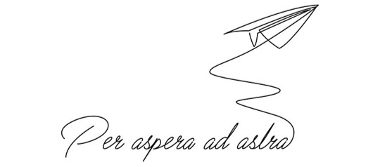

<h1 align="center">Tsubasa Koyama</h1>

  

---
<h2 align="left">Employment History:</h2>
<table align="center">
  <tr>
    <td>09/2023 - present</td>
    <td>
      <b>Software Engineer II,
      <a href="https://www.cadence.com/en_US/home/tools/digital-design-and-signoff/silicon-signoff/pegasus-verification-system.html" target="_blank">Pegasus Verification System</a>,
      <a href="https://www.cadence.com/en_US/home.html/" target="_blank"><i>Cadence Design Systems, Inc.</i></a>,
      Taiwan</b>
    </td>
  </tr>
</table>

---
<h2 align="left">Education:</h2>
<table align="center">
  <tr>
    <td>09/2021 - 08/2023</td>
    <td>
      <b>MSc, 
      <a href="https://dcs.site.nthu.edu.tw/" target="_blank">Computer Science</a>, 
      <a href="https://www.nthu.edu.tw/" target="_blank"><i>National Tsing Hua University</i></a>, Taiwan</b>
    </td>
  </tr>
  <tr>
    <td>09/2017 - 06/2021</td>
    <td>
      <b>BSc, 
      <a href="http://www.csie.tku.edu.tw/" target="_blank">Computer Science and Information Engineering</a>, 
      <a href="https://www.tku.edu.tw/" target="_blank"><i>Tamkang University</i></a>, Taiwan</b>
    </td>
  </tr>
</table>

---

<h3 align="left">Connect with me:</h3>

<h3 align="left">Languages:</h3>

 
 

---
<h2 align="left">Statistical Data:</h2>

